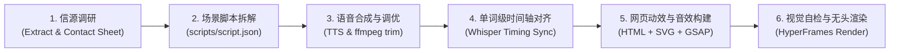

# 🎬 Agentic Motion Graphics (Code-to-Video Pipeline)

> **Autonomous studio-grade motion graphics and programmatic video generation for Claude Opus 5.5, Claude Code, and autonomous AI agents.**  
> *Inspired by Moritz Kremb's viral workflow: "Opus 5.5 solved motion graphics".*

[](LICENSE)
[](https://github.com/heygen-com/hyperframes)
[](https://greensock.com/gsap/)
[](https://github.com/openai/whisper)

---

## 💡 The Core Philosophy: "Videos are Code, Not Edited Footage"

Traditional AI video generation relies heavily on diffusion models (Runway, Pika, Sora, Kling), which suffer from text hallucinations, erratic camera warping, impossible brand consistency, and the inability to tweak a single frame without rerolling the entire video.

**Agentic Motion Graphics** inverts this paradigm:
1. **The Agent never opens a video editor** (No Premiere, After Effects, or CapCut).
2. **Deterministic Code Canvas**: Every frame is defined in standard Web technologies (`HTML5`, `CSS3`, `SVG`, `GSAP`).
3. **Audio is the Master Clock**: Voiceover narration is synthesized, cleaned, and transcribed with **word-level millisecond timestamps** (via Whisper).
4. **Programmatic Audio Synthesis**: Music beds and UI sound effects (whooshes, pops, risers) are synthesized via Python algorithms locked to a 120 BPM grid.
5. **Headless Frame-by-Frame Rendering**: HeyGen's open-source **HyperFrames CLI** drives headless Chromium to render pixel-perfect, artifact-free MP4s at 1080p/4K.

---

## 🚀 The 6-Step Universal Pipeline



1. **信源调研（Research the Source）**: Agent reads web pages, papers, or proposals. For reference videos, `scripts/contact_sheet.py` extracts a tiled contact sheet grid so the LLM can "watch" video pacing and framing.
2. **结构化分镜脚本（Write Script）**: Decomposes concept into `scripts/script.json` (scene IDs, spoken narration, on-screen key typography, visual mechanics, and audio SFX cues).
3. **语音合成与调优（Voiceover & Silence Trimming）**: `scripts/tts_engine.py` calls OpenAI TTS or ElevenLabs voice cloning, and uses `ffmpeg` to trim dead silences and adjust tempo to 1.05x-1.1x.
4. **单词级时间轴对齐（Word-Level Alignment）**: `scripts/timing_aligner.py` extracts exact word start/end millisecond timestamps using `whisper.cpp` / `faster-whisper`.
5. **网页动效与声音构建（Build Visuals & Audio）**: Generates `index.html` with GSAP timelines bound to `timing.json`. Synthesizes 120 BPM music beds and UI sounds via `scripts/synth_sfx.py`.
6. **自检与无头渲染（Check & Headless Render）**:
   - `npx hyperframes lint` validates assets and structure.
   - `npx hyperframes snapshot` grabs keyframe snapshots for Agent multi-modal visual inspection.
   - `npx hyperframes render` produces the final broadcast-grade MP4 video.
   - `ffmpeg` performs -14 LUFS loudness normalization.

---

## 🎯 5 Core Commercial Video Archetypes

| 案例类型 | 适用场景 | 关键机制与提示词 |
| :--- | :--- | :--- |
| **1. SaaS 产品发布动效** | SaaS 软件上线、功能迭代宣传 | 自动爬取官网 UI 截图与矢量 Logo，120 BPM 节奏网格卡点，3D 悬浮透视与光标交互点击。 |
| **2. 论文与深度知识解说** | 技术论文、商业长文、企业 SOP | 提取核心具象隐喻（如“赛车安全车”），代码绘制 SVG 卡通角色与动态背景，配合旁白生动解说。 |
| **3. 长视频转竖屏爆款短片** | TikTok, Reels, YouTube Shorts | 提取转录文本，生成 3 秒黄金停留钩子，9:16 竖屏安全区排版，单词级卡拉 OK 动效字幕。 |
| **4. 个性化客户提案动画** | 高客单价商业提案、项目报价 | 提取客户品牌要素，打造专属讲解虚拟形象（如 Pip 机器人），可视化项目里程碑与 ROI。 |
| **5. 静态 PPT 动态化展示** | 演讲 Keynote、VSL 演示文稿 | 静态 HTML/Markdown 幻灯片无缝注入 GSAP 流体节点动效与卡片 3D 翻转，支持全屏与快捷键互动。 |

*👉 详细 Prompt 模板见 [references/prompts_and_templates.md](./references/prompts_and_templates.md)*

---

## 🛠️ 工具链清单（Tools Under The Hood）

* **渲染核心（Core）**: [HyperFrames CLI](https://github.com/heygen-com/hyperframes) (`npx hyperframes@0.8.71`), GSAP 3, HTML5/CSS3/SVG, Node.js 22+.
* **音频合成（Audio）**: OpenAI TTS (`tts-1-hd` / `gpt-4o-mini-tts`), ElevenLabs (Voice Cloning), Python `numpy`/`scipy` (算法级合成音效与伴奏), `ffmpeg`.
* **时间对齐（Timing）**: `whisper.cpp` (`ggml-small.en`), `faster-whisper`, `Demucs` (伴奏人声分离), `torchaudio` forced alignment.
* **视觉素材（Assets）**: `gpt-image-2`, Cursor Browser (自动化官网长截图), `curl` (矢量资源抓取).
* **信源连接器（Sources）**: Notion MCP, Composio (Tella 录屏), `yt-dlp`, `fxtwitter`.

---

## 📦 快速开始与使用指南

### 1. 环境准备
确保本机安装了 Node.js 22+ 与 FFmpeg：
```bash
# macOS
brew install ffmpeg node

# 验证安装
ffmpeg -version
node -v
```

### 2. 使用配套脚本生成音频与对齐时间戳
```bash
# 1. 生成并净化旁白音频
python3 scripts/tts_engine.py --text "Opus 5.5 solved motion graphics with code." --output audio/voiceover.mp3

# 2. 提取单词级时间戳
python3 scripts/timing_aligner.py --audio audio/voiceover.mp3 --output data/timing.json

# 3. 程序化生成 120 BPM 伴奏
python3 scripts/synth_sfx.py --type track --bpm 120 --duration 10 --output audio/soundtrack.wav
```

### 3. HyperFrames 检验与渲染
```bash
cd templates/boilerplate

# 检查项目合法性
npx hyperframes lint

# 抽取关键帧静态截图供 LLM 视觉审查
npx hyperframes snapshot --time 1.0,2.5,4.0 --output ./snapshots

# 逐帧无头渲染为 MP4
npx hyperframes render --output dist/output.mp4 --fps 30
```

---

## 🤖 针对 Claude Opus 5.5 / LLM Agent 的配置

本仓库遵循 Antigravity & Claude Code 技能规范。将本技能置入 `~/.agents/skills/agentic-motion-graphics` 或项目 `.agents/skills/` 目录下，Agent 将自动发现并调用该管线：

```text
/agentic-motion-graphics
  ├── SKILL.md                          # Agent 核心指令与调度决策树
  ├── references/                       # 深度技术实现规范与 Prompt 模板
  ├── scripts/                          # 语音合成、Whisper 对齐与程序化音效工具
  └── templates/                        # 样板工程与 Schema 校验
```

---

## 📄 License
MIT License. Free to use, adapt, and build agentic video workflows.
