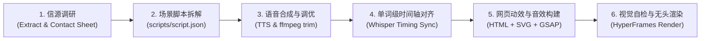

# Agentic Motion Graphics (Code-to-Video Pipeline)

This skill equips Claude Opus 5.5 (and other coding agents) to autonomously generate studio-grade motion graphics and commercial videos purely through **code, structured scripts, audio synthesis, and headless rendering**. 

**Core Principle**: Videos are code, not edited footage. The Agent never opens a video editor like Premiere, After Effects, or CapCut. Instead, it writes an HTML/SVG page animated with GSAP, generates audio/voiceover, extracts word-level timestamps to bind the visual timeline to the spoken voice, and renders the result to MP4 via **HyperFrames CLI**.

---

## 🚀 Quick Reference Workflow (6-Step Pipeline)



1. **Research Source**: Fetch article, Notion proposal, web URL, or reference video. If given a reference video, run `scripts/contact_sheet.py` to extract a contact sheet grid so the LLM can "watch" pacing and design.
2. **Script Writing**: Decompose the concept into `scripts/script.json` (scene by scene, with narration, on-screen text, visual layout, and motion cues).
3. **Voiceover**: Generate voiceover using `scripts/tts_engine.py` (OpenAI TTS or ElevenLabs voice clone), trim silences and adjust tempo with `ffmpeg`.
4. **Timing & Alignment**: Run `scripts/timing_aligner.py` using `whisper.cpp` / `faster-whisper` to generate `timing.json` containing millisecond-accurate timestamps for every word and sentence.
5. **Build Visuals & Audio**: Generate `index.html` with GSAP timeline tied to `timing.json`. Generate procedural sound effects and music backing track on the same BPM clock using `scripts/synth_sfx.py`.
6. **Lint, Snapshot & Render**:
   - Run `npx hyperframes lint` to check structure.
   - Run `npx hyperframes snapshot` at key milestones to visually inspect frames.
   - Run `npx hyperframes render` to output high-resolution MP4.
   - Verify file using `ffprobe` / `ffmpeg` for resolution, audio loudness (e.g. -14 LUFS), and black frames.

---

## 🎬 5 Core Video Archetypes & Invocation Prompts

Refer to [references/prompts_and_templates.md](./references/prompts_and_templates.md) for full templates.

### 1. SaaS Product Launch Video (`product-launch`)
* **Typical Length**: 30 - 60s | **Format**: 16:9 (1920x1080, 30/60fps)
* **Pacing Grid**: 120 BPM beat grid
* **Behavior**: Crawl website assets (vector SVG logos, product UI screenshots, typography). Construct sleek perspective mockups, feature cards, and animated cursor clicks.
* **Prompt Trigger**:
  ```text
  "Create a professional SaaS product launch video for [Product/URL]. Fetch actual brand assets and UI screenshots from the site. Follow a 120 BPM motion rhythm showing core features, metrics, and call-to-action."
  ```

### 2. Article / Paper / SOP Explainer Cartoon (`explainer-cartoon`)
* **Typical Length**: 1 - 3 min | **Format**: 16:9 (1920x1080)
* **Behavior**: Extract the core conceptual metaphor (e.g., pace car for AI safety, pipeline for logistics). Generate clean vector characters (SVG) and dynamic animated scenery.
* **Prompt Trigger**:
  ```text
  "Turn the essay/paper [Title/URL] into an engaging video explainer. Find a central visual metaphor. Draw SVG characters and props, and animate them with full voiceover narration and subtitles."
  ```

### 3. Longform to Shortform Explainer (`shortform-viral`)
* **Typical Length**: 45 - 90s | **Format**: 9:16 (1080x1920, Vertical)
* **Behavior**: Analyze transcript, extract strong 3-second hook, bullet points ("5 things to know"), kinetic kinetic typography, bouncing 3D icons, high contrast.
* **Prompt Trigger**:
  ```text
  "Turn this longform transcript/video into a viral 9:16 vertical shortform explainer for TikTok/Reels in the style of Greg Isenberg. Focus on an irresistible hook and word-by-word highlighted captions."
  ```

### 4. Personalized Commercial Proposal Video (`proposal-video`)
* **Typical Length**: 1.5 - 2.5 min | **Format**: 16:9 (1920x1080)
* **Behavior**: Read client proposal/brief. Create a branded mascot or customized avatar. Walk through project roadmap, deliverables, and pricing cards dynamically.
* **Prompt Trigger**:
  ```text
  "Turn this client proposal into an animated video proposal. Read the deliverables and budget, create a branded guide mascot, and walk through the roadmap. Generate both high-res and email-friendly files."
  ```

### 5. Dynamic Presentation Deck (`dynamic-presentation`)
* **Typical Length**: Interactive / Video slide deck
* **Behavior**: Ingest static presentation HTML or Markdown. Add GSAP physics, floating particles, card reveals, and keyboard navigation (`D` for dynamic/static toggle, `R` for replay, `F` for fullscreen).
* **Prompt Trigger**:
  ```text
  "Convert this static presentation deck into a dynamic animated HTML presentation with GSAP transitions, animated stat counters, and interactive keyboard controls."
  ```

---

## 🎧 Audio Embedding & Synchronization Standards

Refer to [references/audio_pipeline_guide.md](./references/audio_pipeline_guide.md) for step-by-step code.

### 1. TTS Generation
```bash
python3 scripts/tts_engine.py --script scripts/script.json --provider openai --voice alloy --output audio/voiceover.mp3
```
* **Silence Trimming**: Always strip lead/tail silence via ffmpeg (`silenceremove=start_periods=1:start_silence=0.1:start_threshold=-50dB`).
* **Pacing**: Boost speed by 1.05x - 1.15x for punchy social delivery (`atempo=1.08`).

### 2. Word-Level Alignment (Whisper Forced Alignment)
```bash
python3 scripts/timing_aligner.py --audio audio/voiceover.mp3 --output data/timing.json
```
Produces word timestamps:
```json
[
  { "word": "Opus", "start": 0.12, "end": 0.48 },
  { "word": "solved", "start": 0.50, "end": 0.85 },
  { "word": "motion", "start": 0.88, "end": 1.15 }
]
```

### 3. Procedural SFX & Music Synthesis
When licensed music or external generators are unavailable, synthesize crisp backing tracks and UI sound effects directly via Python `numpy`/`scipy`:
```bash
python3 scripts/synth_sfx.py --bpm 120 --duration 45 --output audio/backing_track.wav
```
* Generates sine-sweep whooshes, click pops, risers, and rhythmic drum/sub-bass pulses locked to video cuts.

---

## 💻 HyperFrames + GSAP Rendering Standards

Refer to [references/hyperframes_recipes.md](./references/hyperframes_recipes.md) for full project architecture.

### Setup & Requirements
* **Node.js**: v22+
* **HyperFrames CLI**: `npx hyperframes@0.8.71`
* **FFmpeg**: Required on system PATH

### Directory Structure
```text
my-video-project/
├── scripts/
│   ├── script.json          # Scene-by-scene narration and visual cues
│   ├── tts.py               # Voiceover generation
│   └── timing.py            # Whisper timestamp extraction
├── assets/                  # Logos, screenshots, fonts, SVG icons
├── audio/
│   ├── voiceover.mp3        # Master voiceover
│   └── soundtrack.wav       # Mixed backing track + SFX
├── data/
│   └── timing.json          # Word-level sync data
├── index.html               # Main visual markup + GSAP timeline
├── style.css                # Layout and typography
├── animation.js             # GSAP code driven by timing.json
├── hyperframes.json         # Video dimensions, FPS, duration
└── package.json
```

### Execution Commands
```bash
# 1. Check for missing assets, syntax errors, or timeline overlaps
npx hyperframes lint

# 2. Inspect key moments without full rendering (Agent visual self-check)
npx hyperframes snapshot --time 0,2.5,5.0,12.0 --output ./snapshots/

# 3. Headless high-resolution render to MP4
npx hyperframes render --output dist/final_video.mp4 --fps 30
```

---

## 🔍 Agent Self-Correction & QA Loop

Since LLM agents cannot directly watch video playback or listen to audio:
1. **Visual Quality**: Inspect extracted snapshots (`./snapshots/snapshot_*.png`) using image-viewing tools to verify typography hierarchy, lack of text overflow, and aesthetic composition.
2. **Audio Loudness**: Run `ffmpeg -i dist/final_video.mp4 -filter:a loudnorm=print_format=json -f null -` to verify integrated loudness is close to `-14.0 LUFS` (standard for web/X/YouTube).
3. **Black Frames & Duration**: Check video duration matches audio duration within 100ms tolerance using `ffprobe`.
