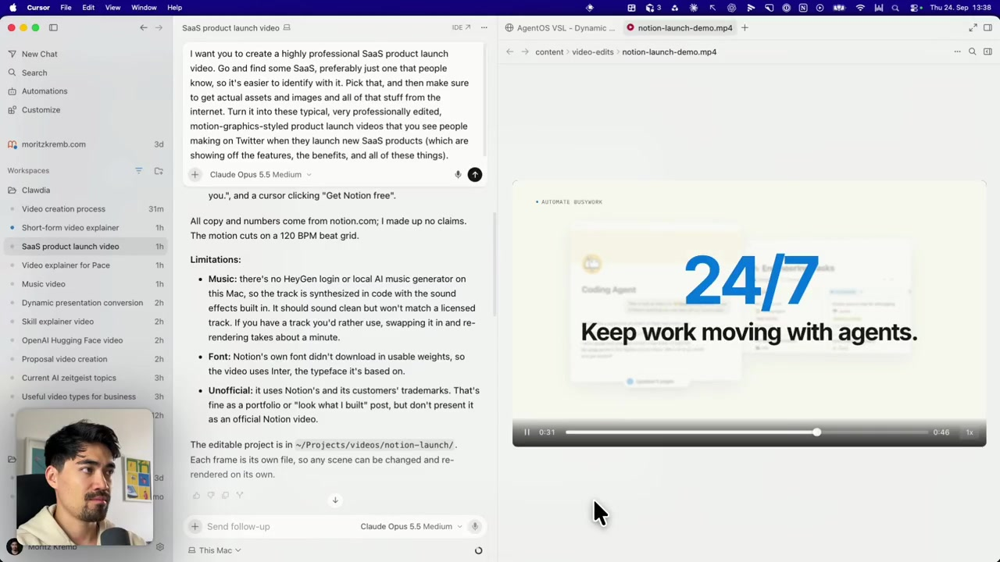
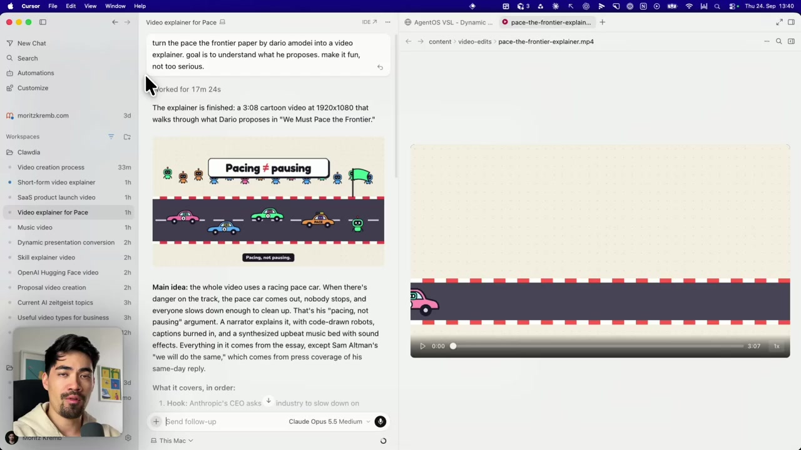
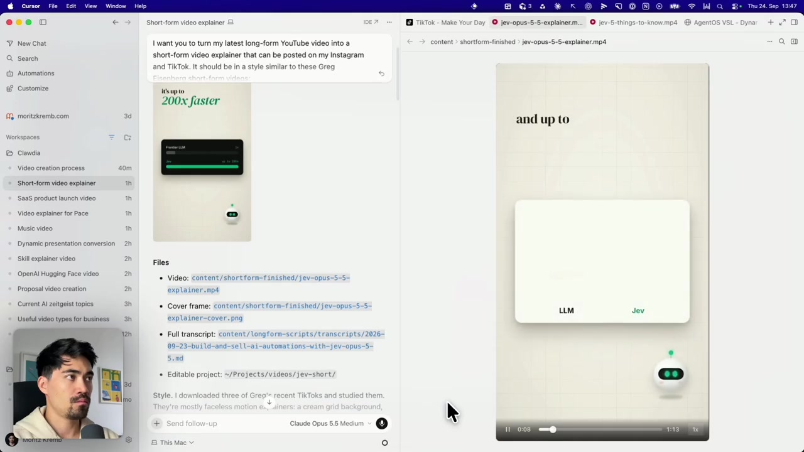
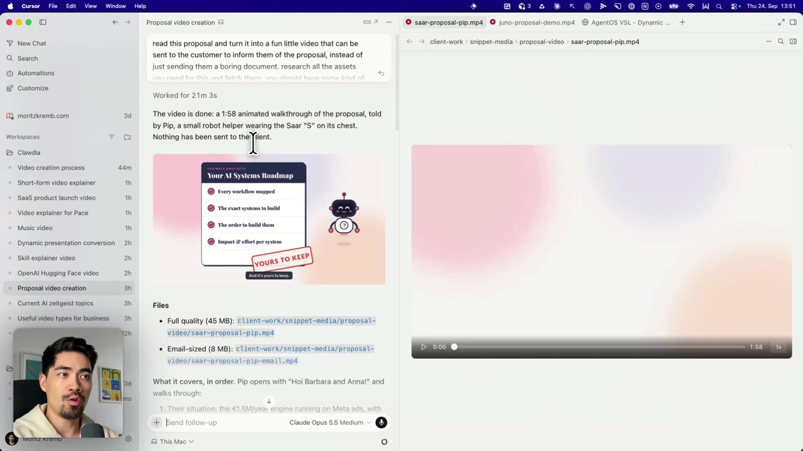
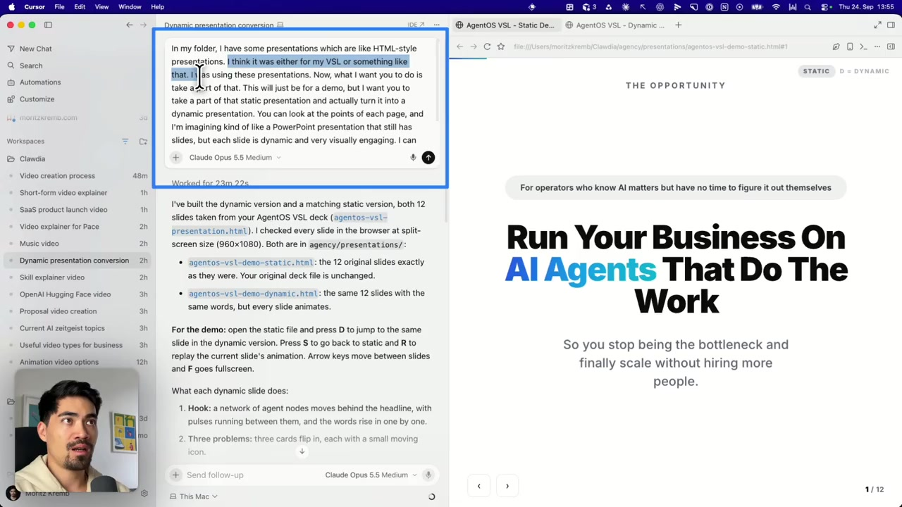
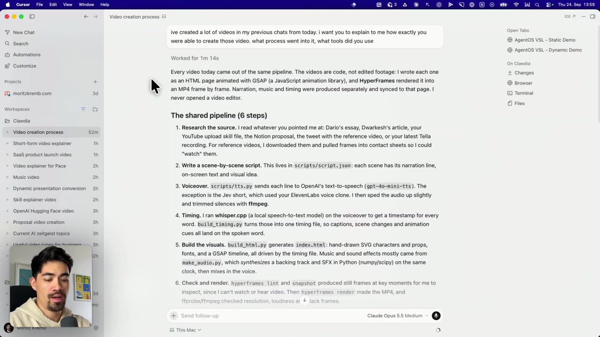
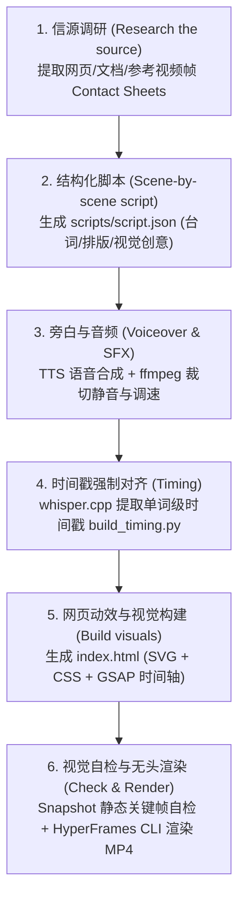
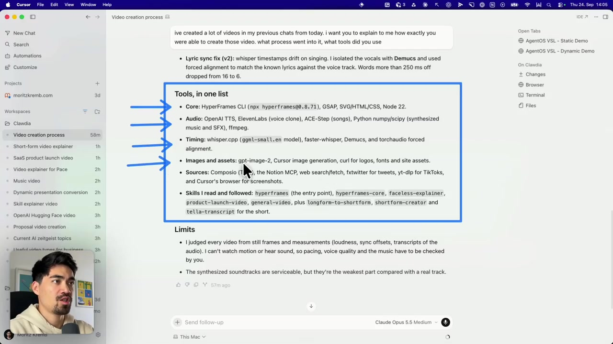

# Claude Opus 5.5 动效生成（Motion Graphics）实操案例与深度分析

> **来源原帖**：[Moritz Kremb on X (@moritzkremb)](https://x.com/moritzkremb/status/2103115037334262241)  
> **原片时长**：22 分 59 秒  
> **核心主题**：*Opus 5.5 solved motion graphics*（Opus 5.5 攻克动效设计）  
> **核心理念**：AI 时代制作动态图形与商业宣传片**无需打开任何传统视频剪辑软件**（After Effects / Premiere / 剪映），而是采用 **“Code-to-Video（代码驱动视频）”** 的 Agentic 全自动工作流。

---

## ⏱️ 视频时间轴快速索引（Video Timeline Index）

| 章节内容 | 视频时间戳 | 核心内容 / 演示重点 |
| :--- | :--- | :--- |
| **开篇引入** | `00:00 - 02:20` | Opus 5.5 发布背景与动效能力革新概述 |
| **场景 1：SaaS 产品发布动效视频** | `02:20 - 05:24` | Notion 发布演示片、120 BPM 节拍网格、官网素材自动爬取 |
| **场景 2：深度长文与知识解说视频** | `05:24 - 08:30` | Dario Amodei 论文转卡通赛车隐喻解说片（3:08 动画） |
| **场景 3：长视频转竖屏短视频** | `08:30 - 12:56` | YouTube 长片转 TikTok/Reels 竖屏爆款风格（Greg Isenberg 风格） |
| **场景 4：个性化客户商业提案视频** | `12:56 - 15:23` | PDF 方案转机器人 Pip 路线图演示动画（高质量与邮件直发版） |
| **场景 5：静态演示文稿动态化** | `15:23 - 17:17` | 12 页静态 AgentOS 演讲稿升级为交互式动态演示网页 |
| **底层架构：6 步通用代码流水线** | `17:17 - 21:15` | Agent 幕后揭秘：信源调研、脚本、TTS、Whisper 对齐、GSAP、HyperFrames |
| **工具清单：Under The Hood 全景栈** | `21:15 - 22:59` | 核心引擎、音频、对齐模型、抓取工具与 Agent Skills 汇总 |

---

## 一、 5 个商业应用场景与效果示例

### 场景 1：SaaS 产品发布动效视频（Product Launch Videos）
* **⏱️ 对应视频片段**：`02:20 - 05:24`
* **需求场景**：为 SaaS 软件自动制作类似 Twitter/X 上爆款的专业产品发布动效视频，展示核心功能与界面。
* **Agent 提示词（Prompt）**：
  > *"I want you to create a highly professional SaaS product launch video. Go and find some SaaS, preferably just one that people know, so it's easier to identify with it. Pick that, and then make sure to get actual assets and images and all of that stuff from the internet. Turn it into these typical, very professionally edited, motion-graphics-styled product launch videos that you see people making on Twitter when they launch new SaaS products (which are showing off the features, the benefits, and all of these things)."*
* **执行成果与参数**：
  * 输出文件：`content/video-edits/notion-launch-demo.mp4`（46 秒，1080P/30fps，20MB）。
  * 制作逻辑：Agent 自主访问 `notion.com` 获取真实 UI 资产与文案，基于 120 BPM 节奏网格对齐动画镜头与音效。
* **效果实录**（📸 对应原视频 `04:35` 处）：
  

---

### 场景 2：深度长文与知识解说视频（Explainers for Articles & SOPs）
* **⏱️ 对应视频片段**：`05:24 - 08:30`
* **需求场景**：将长篇技术论文、行业深度长文或企业 SOP 规章快速转化为趣味卡通动效解说视频。
* **Agent 提示词（Prompt）**：
  > *"Turn the 'Pace the Frontier' paper by Dario Amodei into a video explainer, goal is to understand what he proposes. Make it fun, not too serious."*
* **执行成果与参数**：
  * 输出文件：`content/video-edits/pace-the-frontier-explainer.mp4`（3 分 08 秒，1080P，耗时 17 分 24 秒生成）。
  * 制作逻辑：提取论文核心隐喻——将“步伐调控（Pacing, not pausing）”具象化为赛车跑道上的安全车（Pace Car），自主编写代码绘制 SVG 卡通机器人、赛道与赛车，配合旁白生动解释复杂观点。
* **效果实录**（📸 对应原视频 `05:42` 处）：
  

---

### 场景 3：长视频转竖屏短视频（Turn Longform Videos into Short-form）
* **⏱️ 对应视频片段**：`08:30 - 12:56`
* **需求场景**：将横屏 YouTube 长视频/访谈转化为适合 TikTok、Instagram Reels 的高留存竖屏短视频。
* **Agent 提示词（Prompt）**：
  > *"I want you to turn my latest long-form YouTube video into a short-form video explainer that can be posted on my Instagram and TikTok. It should be in a style similar to these Greg Isenberg short-form videos... Make sure you look at the transcript of the video, turn it into a compelling shortform video. It should have a strong hook and a..."*
* **执行成果与参数**：
  * 输出文件：`content/shortform-finished/jev-5-things-to-know.mp4`。
  * 制作逻辑：提取长视频转录字幕文本，提炼“必须知道的 5 件事”强钩子结构，自动匹配竖屏 9:16 画布比例，绘制 3D 浮动感微动效并生成精准卡点弹幕字幕。
* **效果实录**（📸 对应原视频 `09:40` 处）：
  

---

### 场景 4：个性化客户商业提案视频（Personalized Video Proposals）
* **⏱️ 对应视频片段**：`12:56 - 15:23`
* **需求场景**：摒弃传统枯燥的 PDF 报价与方案文件，为潜在客户生成个性化、高转化率的动态方案演示。
* **Agent 提示词（Prompt）**：
  > *"Read this proposal and turn it into a fun little video that can be sent to the customer to inform them of the proposal, instead of just sending them a boring document. Research all the assets you need for this and fetch them... You should have some kind of..."*
* **执行成果与参数**：
  * 输出文件：`saar-proposal-pip.mp4`（1 分 58 秒，耗时 21 分 03 秒）。提供 45MB 高画质版与 8MB 邮件直发压缩版。
  * 制作逻辑：Agent 阅读客户方案后，创造了一个胸前印有客户品牌 Logo 的专属小机器人助手 Pip，以生动的路线图动画逐页展示项目里程碑。
* **效果实录**（📸 对应原视频 `13:18` 处）：
  

---

### 场景 5：静态演示文稿动态化（Animated Presentations）
* **⏱️ 对应视频片段**：`15:23 - 17:17`
* **需求场景**：将静态的 HTML/PPT 幻灯片升级为具有流畅转场、节点动态连接的互动演示文稿。
* **Agent 提示词（Prompt）**：
  > *"In my folder, I have some presentations which are like HTML-style presentations... Take a part of that static presentation and actually turn it into a dynamic presentation... Kind of like a PowerPoint presentation that still has slides, but each slide is dynamic and very visually engaging..."*
* **执行成果与参数**：
  * 输出文件：`agentos-vsl-demo-dynamic.html`（12 页，耗时 23 分 22 秒）。
  * 制作逻辑：保持原有演讲稿文案一致，为每个卡片和文字注入 GSAP 动效（如节点流动、卡片 3D 翻转交互），并配备按键交互（D 键对比静态/动态，R 键重播，F 键全屏）。
* **效果实录**（📸 对应原视频 `15:45` 处）：
  

---

## 二、 底层原理与 6 步共享流水线（The Shared Pipeline）

* **⏱️ 对应视频片段**：`17:17 - 21:15`

在视频 17:17 处，Moritz 让 Claude Opus 5.5 解释了其背后的技术原理。Claude Opus 强调：**所有的视频均不是用剪辑软件剪切出来的预渲染素材，而是完全由代码构建而成（The videos are code, not edited footage: I wrote each one as an HTML page animated with GSAP, and HyperFrames rendered it into an MP4 frame by frame. I never opened a video editor）**。

* **架构实录截图**（📸 对应原视频 `17:35` 处）：
  

---

## 三、 完整工具链清单（Tools Under the Hood）

* **⏱️ 对应视频片段**：`21:15 - 22:59`

视频最后展示了完整的技术栈清单：

* **工具栈实录截图**（📸 对应原视频 `21:20` 处）：
  

| 类别 | 采用的工具与技术 | 核心职责 | 视频出现节点 |
| :--- | :--- | :--- | :--- |
| **渲染核心（Core）** | **HyperFrames CLI** (`npx hyperframes@0.8.71`) | HeyGen 开源的 Web 视频无头渲染框架 | `17:40`, `21:20` |
| | **GSAP (GreenSock)** | 业内标准的 JavaScript 动效与时间轴编排引擎 | `17:40`, `21:20` |
| | **SVG / HTML / CSS / Node 22** | 纯 Web 标准前端技术，具备确定性、可控性与高精度 | `18:10`, `21:20` |
| **音频处理（Audio）** | **OpenAI TTS / ElevenLabs** | 语音旁白合成与自定义音色克隆 | `18:45`, `21:20` |
| | **Python (`numpy` / `scipy`)** | 代码算法级程序化合成背景伴奏节拍与 SFX 音效 | `19:20`, `21:20` |
| | **ffmpeg** | 音频静音裁剪、调速、音轨合并与音画同步 | `18:50`, `21:20` |
| **时间对齐（Timing）**| **whisper.cpp** (`ggml-small.en`) / **faster-whisper** | 本地运行的高性能语音转文本与单词时间戳提取 | `19:05`, `21:20` |
| | **Demucs & torchaudio** | 人声/伴奏分离与歌词/语音的强制对齐（Forced Alignment） | `21:05`, `21:20` |
| **视觉素材（Assets）** | **gpt-image-2** / Cursor 图像生成 | 生成特定视觉插画与材质纹理 | `21:25` |
| | **curl / Cursor 浏览器** | 抓取品牌官网的高清矢量 Logo、字体与网页长截图 | `21:25` |
| **信源对接（Sources）**| **Notion MCP / Composio (Tella) / yt-dlp / fxtwitter** | 自动化拉取 Notion 文档、录屏素材、推文与社交视频 | `21:30` |
| **预置技能（Skills）** | `hyperframes`, `faceless-explainer`, `product-launch-video` 等 | 为 Agent 预先固化的设计模版与执行 SOP 规范 | `21:35` |
