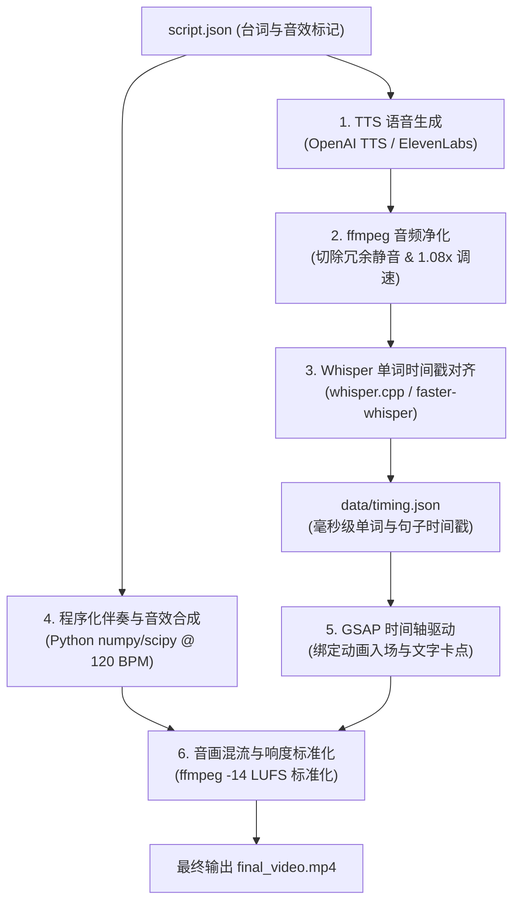

# Audio Pipeline & Audio-Visual Synchronization Guide

In programmatic motion graphics, **sound is the master clock**. Visual animations do not drive the audio; rather, audio defines the temporal grid to which every visual cut, GSAP tween, and subtitle animation snaps.

---

## 🎧 Complete Audio Architecture



---

## 1. 语音生成与音频净化（Voiceover Generation & Cleaning）

### 1.1 OpenAI TTS 快速合成
对于绝大多数解说和商业演示，使用 OpenAI 的 TTS 接口：
```python
import os
from openai import OpenAI

client = OpenAI()

def generate_voiceover(text: str, output_path: str, voice: str = "alloy"):
    response = client.audio.speech.create(
        model="tts-1-hd", # 或 gpt-4o-mini-tts
        voice=voice,
        input=text,
        speed=1.0
    )
    response.stream_to_file(output_path)
```

### 1.2 ElevenLabs 声音克隆（针对个人 IP / 创作者）
```python
import requests

def generate_elevenlabs(text: str, voice_id: str, output_path: str):
    url = f"https://api.elevenlabs.io/v1/text-to-speech/{voice_id}"
    headers = {
        "xi-api-key": os.getenv("ELEVENLABS_API_KEY"),
        "Content-Type": "application/json"
    }
    payload = {
        "text": text,
        "model_id": "eleven_multilingual_v2",
        "voice_settings": {"stability": 0.5, "similarity_boost": 0.8}
    }
    res = requests.post(url, json=payload, headers=headers)
    with open(output_path, "wb") as f:
        f.write(res.content)
```

### 1.3 FFmpeg 自动去除静音与微调语速
原始 TTS 通常包含开头与结尾的长达 300ms-800ms 的空白静音，且节奏偏平缓。必须进行自动化净化：
```bash
# 1. 裁除开头和结尾低于 -50dB 的空白静音
# 2. 适度加速 1.08x，使语速更有商业节奏感
ffmpeg -i raw_voiceover.mp3 -af "silenceremove=start_periods=1:start_silence=0.05:start_threshold=-50dB,areverse,silenceremove=start_periods=1:start_silence=0.05:start_threshold=-50dB,areverse,atempo=1.08" -b:a 192k clean_voiceover.mp3 -y
```

---

## 2. 单词级时间戳对齐（Word-Level Timestamp Alignment）

为了实现类似卡拉 OK 般的精准字幕高亮、角色口型联动与镜头卡点，必须获得精确到**毫秒级的单词时间戳**。

### 2.1 本地快速对齐（基于 whisper.cpp 或 faster-whisper）
```python
import json
from faster_whisper import WhisperModel

def extract_word_timestamps(audio_file: str, output_json: str):
    # 使用 small.en 或 base 模型，运行极快
    model = WhisperModel("small.en", device="cpu", compute_type="int8")
    segments, info = model.transcribe(audio_file, word_timestamps=True)
    
    timing_data = []
    for segment in segments:
        for word in segment.words:
            timing_data.append({
                "word": word.word.strip(),
                "start": round(word.start, 3),
                "end": round(word.end, 3),
                "confidence": round(word.probability, 2)
            })
            
    with open(output_json, "w", encoding="utf-8") as f:
        json.dump(timing_data, f, indent=2, ensure_ascii=False)
```

输出的 `data/timing.json` 格式：
```json
[
  { "word": "Opus", "start": 0.120, "end": 0.480, "confidence": 0.98 },
  { "word": "solved", "start": 0.500, "end": 0.850, "confidence": 0.95 },
  { "word": "motion", "start": 0.880, "end": 1.150, "confidence": 0.99 }
]
```

### 2.2 歌曲/伴奏的人声分离与对齐（Demucs + Torchaudio）
如果输入信源自带背景音乐导致 Whisper 时间戳飘移（Drift）：
1. 运行 `demucs --two-stems=vocals input.mp3` 分离纯人声轨；
2. 对分离后的纯人声轨运行 `torchaudio.pipelines.MMS_FA` 强制对齐，将已知歌词与音频强制贴合，将时间戳误差控制在 10ms 以内。

---

## 3. 程序化伴奏与交互音效合成（Procedural Audio & SFX）

在没有版权音乐库或第三方音效订阅时，Agent 可以直接在 Python 中使用 `numpy` 和 `scipy` 生成与视频节奏严格对齐的合成音乐与音效。

### 3.1 常见程序化音效配方
* **卡点低音脉冲（808 Sub-bass Pulse）**：正弦波 60Hz 快速指数衰减，用于场景切换或大数字揭晓。
* **高频点击声（UI Click/Pop）**：1200Hz - 2400Hz 极短微脉冲（10-20ms），用于按钮点击或字幕弹跳。
* **转场风声（Whoosh/Swish）**：白噪声通过带通滤波器做频率自下而上的快速扫频（Sweep）。
* **蓄力上升音（Riser）**：锯齿波从 200Hz 缓慢上扬到 800Hz，用于揭示核心产品前的蓄力。

```python
import numpy as np
from scipy.io import wavfile

SAMPLE_RATE = 44100

def generate_sfx_pop(duration=0.03):
    """按钮点击弹出音效"""
    t = np.linspace(0, duration, int(SAMPLE_RATE * duration), False)
    freq = np.linspace(1600, 400, len(t))
    signal = np.sin(2 * np.pi * freq * t) * np.exp(-t * 80)
    return signal

def generate_whoosh(duration=0.3):
    """运镜转场风声"""
    t = np.linspace(0, duration, int(SAMPLE_RATE * duration), False)
    noise = np.random.uniform(-1, 1, len(t))
    envelope = np.sin(np.pi * t / duration) ** 2
    return noise * envelope * 0.4
```

---

## 4. 网页动效与音频时间戳绑定（GSAP Timeline Binding）

在 `animation.js` 中，引入提取好的 `timing.json`，将视觉动画直接锚定在音频时间戳上：

```javascript
// animation.js
fetch('./data/timing.json')
  .then(res => res.json())
  .then(timing => {
    const tl = gsap.timeline({ paused: true });

    // 1. 遍历时间戳，绑定每个单词的弹跳高亮
    timing.forEach(({ word, start, end }) => {
      const el = document.querySelector(`[data-word="${word}"]`);
      if (el) {
        tl.to(el, { 
          color: "#4f46e5", 
          scale: 1.15, 
          duration: 0.1, 
          ease: "power2.out" 
        }, start);
        
        tl.to(el, { 
          color: "#111827", 
          scale: 1.0, 
          duration: 0.1 
        }, end);
      }
    });

    // 2. 将 GSAP 时间轴的当前时间与 HyperFrames 逐帧时钟同步
    window.renderFrame = function(currentTimeInSeconds) {
      tl.seek(currentTimeInSeconds);
    };
  });
```

---

## 5. 混音输出与标准合流（Final Mixdown & Compliance）

视频通过 HyperFrames 渲染出静音的视觉 MP4 之后，使用 ffmpeg 将其与处理好的伴奏、配音合并，并强制将响度标准化为互联网商业标准（`-14.0 LUFS`）：

```bash
# 音画合流 + 响度标准化 (-14 LUFS)
ffmpeg -i visual_render.mp4 -i clean_voiceover.mp3 -i backing_track.wav \
  -filter_complex "[1:a]volume=1.0[vocal]; [2:a]volume=0.25[bgm]; [vocal][bgm]amix=inputs=2:duration=first[mixed]; [mixed]loudnorm=I=-14:LRA=7:TP=-1.5[outa]" \
  -map 0:v -map "[outa]" -c:v copy -c:a aac -b:a 256k final_launch_video.mp4 -y
```

### 自动化质检校验命令：
```bash
# 验证音频响度
ffprobe -v error -show_entries format_tags -of default=noprint_wrappers=1:nokey=1 final_launch_video.mp4

# 验证音画总时长是否对齐（误差控制在 0.1s 以内）
ffprobe -v error -show_entries format=duration -of default=noprint_wrappers=1:nokey=1 final_launch_video.mp4
```
